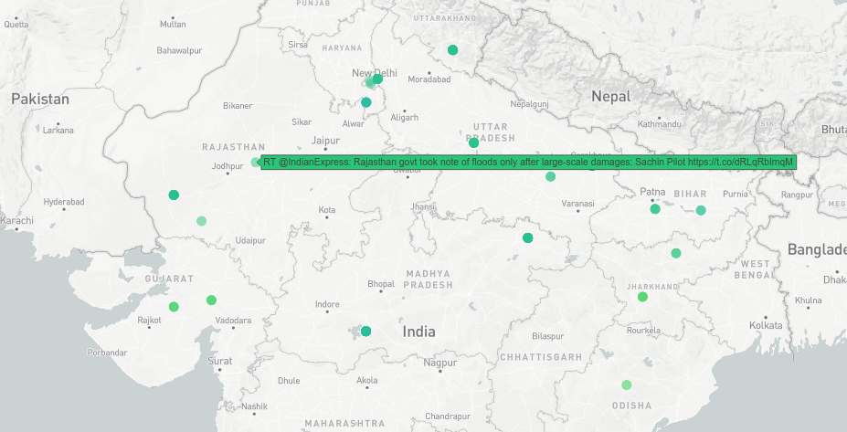
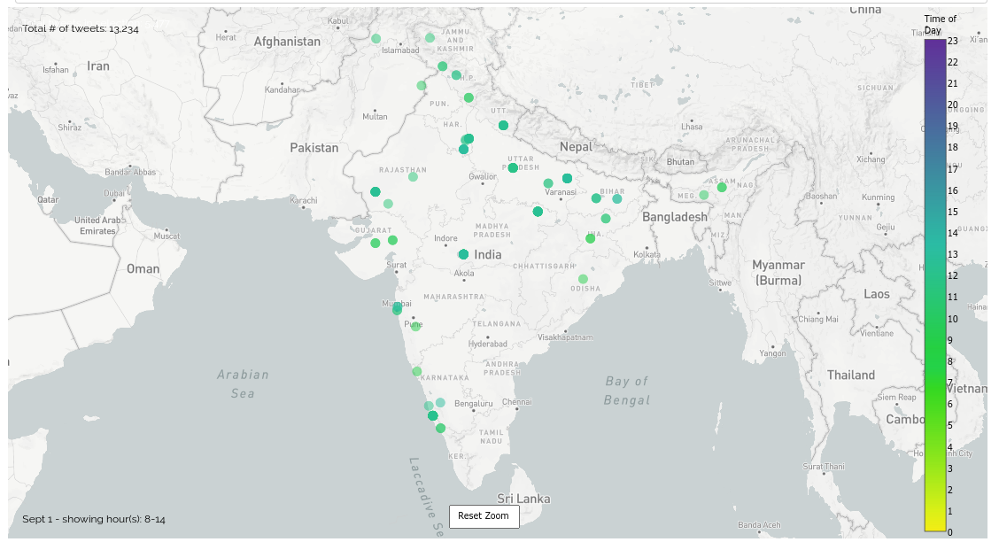
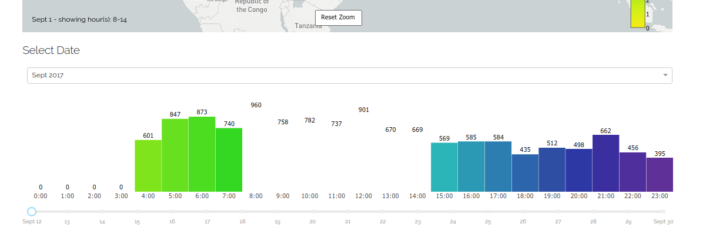
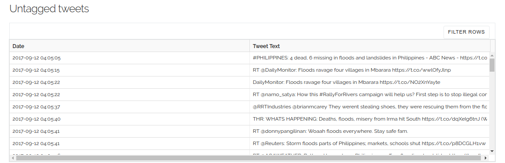

# Savitr

Visualizing Tweets on a map. Built on Dash by Plotly.

The frontend denotes tweets per day, colour coded by the time of tweet.

The backend / pre-processing for this is available on [kaustubhhiware/Savitr](https://github.com/kaustubhhiware/Savitr)

## Usage

```
pip install -r requirements.txt
gunicorn app:server
```

## Content

* A search bar at the top of the page. Whenever a term is entered into the search bar, the map refreshes and shows tweets pertaining to that query term. It also supports multiple search queries like "Dengue, Malaria".

* The tweets on the map are color coded according to the time of the day. Tweets posted in the night are darker.

* A date-picker – if one wishes to visualize tweets posted during a particular time duration, this provides fine grained date selection, both at the month and date level.

* A Histogram – this shows the number of relevant (tagged) tweets posted per day.

* Untagged tweets – Finally, at the bottom of the page we display the tweets for which location could not be inferred (and hence they could not be shown on the map).

## Screenshots:


Hovering over any point reveals the tweet text.



Using the bar chart underneath, it is possible to restrict the view only to a certain hours. 




For tweets in which the location could not be detected, all untagged tweets are displayed in a tabular form.



## License

The MIT License (MIT) 2018 - Avijit Ghosh. Have a look at the [LICENSE](LICENSE) for more details.